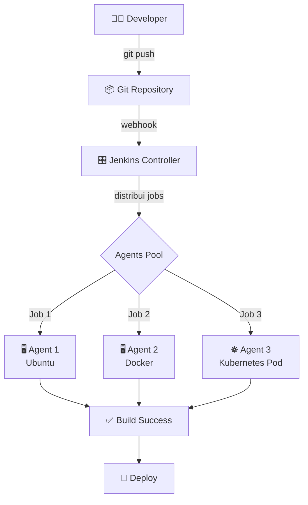
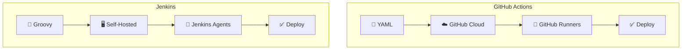
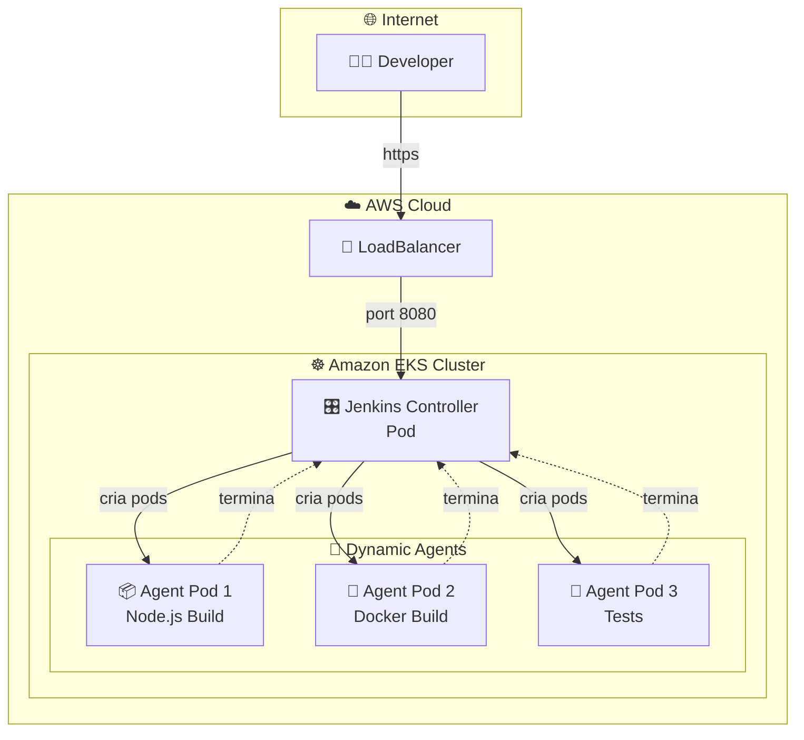

# 🎬 Vídeo 1.3 - Análise Comparativa: Jenkins vs GitHub Actions

**Aula**: 1 - Fundamentos CI/CD  
**Vídeo**: 1.3  
**Temas**: Jenkins; Jenkinsfile; Comparação; Deploy AWS  
**Tempo**: 20 minutos

---

## 📚 Parte 1: Introdução ao Jenkins

### Passo 1: O que é Jenkins?

**Jenkins** = Servidor de automação open-source para CI/CD

**Características:**
- 🔓 Open-source (gratuito)
- 🔌 Mais de 1800+ plugins
- 🏗️ Altamente customizável
- 🐳 Pode rodar em containers
- ☁️ Pode rodar na AWS (EC2, ECS, EKS)

**Arquitetura Jenkins:**



**Conceitos Principais:**
- **Controller**: Servidor que gerencia pipelines
- **Agent**: Máquina que executa os jobs
- **Pipeline**: Sequência de stages
- **Stage**: Agrupamento de steps (Build, Test, Deploy)
- **Step**: Comando individual

### Passo 2: Jenkinsfile - Pipeline as Code

**Jenkinsfile** = Arquivo que define o pipeline (similar ao YAML do GitHub Actions)

**Sintaxe: Groovy DSL**

```groovy
pipeline {
    agent any
    
    stages {
        stage('Build') {
            steps {
                echo 'Building...'
            }
        }
        stage('Test') {
            steps {
                echo 'Testing...'
            }
        }
    }
}
```

---

## 🔄 Parte 2: Comparação Lado a Lado

### Passo 3: Mesmo Pipeline em Ambas Ferramentas

**Cenário:** Pipeline para build e teste de aplicação Node.js

#### **GitHub Actions (YAML)**

```yaml
name: CI Pipeline

on:
  push:
    branches: [main]

jobs:
  build-and-test:
    runs-on: ubuntu-latest
    
    steps:
      - name: Checkout
        uses: actions/checkout@v4
      
      - name: Setup Node.js
        uses: actions/setup-node@v4
        with:
          node-version: '18'
      
      - name: Install Dependencies
        run: npm ci
      
      - name: Run Tests
        run: npm test
      
      - name: Build
        run: npm run build
```

#### **Jenkins (Groovy)**

```groovy
pipeline {
    agent {
        docker {
            image 'node:18-alpine'
        }
    }
    
    stages {
        stage('Checkout') {
            steps {
                checkout scm
            }
        }
        
        stage('Install Dependencies') {
            steps {
                sh 'npm ci'
            }
        }
        
        stage('Test') {
            steps {
                sh 'npm test'
            }
        }
        
        stage('Build') {
            steps {
                sh 'npm run build'
            }
        }
    }
}
```

### Passo 4: Comparação Visual



**Comparação Rápida:**

| Aspecto | GitHub Actions | Jenkins |
|---------|---------------|---------|
| **Formato** | YAML (fácil) | Groovy (complexo) |
| **Hospedagem** | ☁️ Cloud GitHub | 🖥️ Self-hosted |
| **Setup** | Zero config | Requer instalação |
| **Custo** | Grátis (limites) | Grátis (sua infra) |
| **Integração** | ✅ Nativa GitHub | ⚙️ Via plugins |
| **Flexibilidade** | Média | Alta |

---

## 🏗️ Parte 3: Jenkinsfile do Projeto

### Passo 5: Analisar Jenkinsfile Existente

```bash
# Ver Jenkinsfile do projeto
cat Jenkinsfile
```

**Jenkinsfile Completo:**

```groovy
pipeline {
    agent {
        kubernetes {
            yaml """
apiVersion: v1
kind: Pod
spec:
  containers:
  - name: node
    image: node:20-alpine
    command:
    - cat
    tty: true
  - name: docker
    image: docker:24-dind
    securityContext:
      privileged: true
"""
        }
    }
    
    environment {
        APP_NAME = 'fiap-cicd-demo'
        NODE_VERSION = '20'
    }
    
    stages {
        stage('📥 Checkout') {
            steps {
                echo '📥 Fazendo checkout do código...'
                checkout scm
            }
        }
        
        stage('🔍 Environment Info') {
            parallel {
                stage('Node Info') {
                    steps {
                        container('node') {
                            sh '''
                                echo "Node version: $(node --version)"
                                echo "NPM version: $(npm --version)"
                            '''
                        }
                    }
                }
                stage('System Info') {
                    steps {
                        sh '''
                            echo "OS: $(uname -a)"
                            echo "Date: $(date)"
                        '''
                    }
                }
            }
        }
        
        stage('📦 Dependencies') {
            steps {
                container('node') {
                    dir('app') {
                        sh 'npm ci'
                    }
                }
            }
        }
        
        stage('🧪 Tests') {
            parallel {
                stage('Unit Tests') {
                    steps {
                        container('node') {
                            dir('app') {
                                sh 'npm test'
                            }
                        }
                    }
                }
                stage('Coverage') {
                    steps {
                        container('node') {
                            dir('app') {
                                sh 'npm run test:coverage'
                            }
                        }
                    }
                }
            }
        }
        
        stage('🔒 Security') {
            steps {
                container('node') {
                    dir('app') {
                        sh 'npm audit --audit-level=moderate || true'
                    }
                }
            }
        }
        
        stage('🏗️ Build') {
            steps {
                container('node') {
                    dir('app') {
                        sh 'echo "Building application..."'
                    }
                }
            }
        }
    }
    
    post {
        always {
            echo '🧹 Limpando workspace...'
            cleanWs()
        }
        success {
            echo '🎉 Pipeline executado com sucesso!'
        }
        failure {
            echo '❌ Pipeline falhou!'
        }
    }
}
```

**Conceitos Importantes:**

1. **`agent { kubernetes }`**: Executa em pods Kubernetes (EKS na AWS)
2. **`container('node')`**: Executa comandos em container específico
3. **`parallel`**: Executa stages em paralelo
4. **`post`**: Ações pós-execução (sempre, sucesso, falha)
5. **`environment`**: Variáveis de ambiente
6. **`dir('app')`**: Muda diretório de trabalho

---

## ☁️ Parte 4: Jenkins no Amazon EKS

### Passo 6: Arquitetura Jenkins no EKS

**Por que EKS para Jenkins em Produção?**
- ✅ Escalabilidade automática de agents
- ✅ Isolamento de builds em pods
- ✅ Alta disponibilidade
- ✅ Gerenciamento simplificado
- ✅ Integração nativa com AWS

**Arquitetura Jenkins no EKS:**



**Vantagens:**
- ✅ Agents criados dinamicamente (só quando necessário)
- ✅ Isolamento total entre builds
- ✅ Escalabilidade automática
- ✅ Custo otimizado (paga só quando usa)

### Passo 7: Criar Cluster EKS (Comandos de Referência)

**⚠️ IMPORTANTE:** Na aula, o cluster já estará criado. Estes comandos são para referência.

**🚨 LIMITAÇÕES DO AWS LEARNER LAB:**
- ✅ EKS é suportado, mas com restrições
- ❌ **Managed Node Groups NÃO funcionam** (falta de permissões IAM)
- ✅ **Self-managed Node Groups funcionam** (via EC2 Auto Scaling)
- ✅ Use apenas a role `LabRole` disponível no Learner Lab

---

**Via AWS CLI (Learner Lab)**

**Linux/Mac:**

```bash
# Verificar credenciais
aws sts get-caller-identity --profile fiapaws

# Obter Account ID
ACCOUNT_ID=$(aws sts get-caller-identity --profile fiapaws --query Account --output text)
echo "Account ID: $ACCOUNT_ID"

# Descobrir subnets públicas automaticamente (exclui us-east-1e)
SUBNETS=$(aws ec2 describe-subnets \
  --profile fiapaws \
  --region us-east-1 \
  --filters "Name=map-public-ip-on-launch,Values=true" \
  --query 'Subnets[?AvailabilityZone!=`us-east-1e`].SubnetId' \
  --output text | tr '\t' ',')
echo "Subnets: $SUBNETS"

# 1. Criar cluster EKS (control plane)
aws eks create-cluster \
  --name cicd-lab \
  --region us-east-1 \
  --role-arn arn:aws:iam::${ACCOUNT_ID}:role/LabRole \
  --resources-vpc-config subnetIds=${SUBNETS} \
  --profile fiapaws

# 2. Aguardar cluster ficar ativo (15-20 min)
aws eks wait cluster-active \
  --name cicd-lab \
  --region us-east-1 \
  --profile fiapaws

# 3. Configurar kubectl
aws eks update-kubeconfig \
  --name cicd-lab \
  --region us-east-1 \
  --profile fiapaws

# 4. Criar Node Group
# Reutilizar as mesmas subnets descobertas
SUBNETS_SPACE=$(echo $SUBNETS | tr ',' ' ')

aws eks create-nodegroup \
  --cluster-name cicd-lab \
  --nodegroup-name workers \
  --node-role arn:aws:iam::${ACCOUNT_ID}:role/LabRole \
  --subnets $SUBNETS_SPACE \
  --instance-types t3.medium \
  --scaling-config minSize=2,maxSize=2,desiredSize=2 \
  --region us-east-1 \
  --profile fiapaws

# 5. Aguardar node group ficar ativo (5-10 min)
aws eks wait nodegroup-active \
  --cluster-name cicd-lab \
  --nodegroup-name workers \
  --region us-east-1 \
  --profile fiapaws

# 6. Verificar nodes
kubectl get nodes
```

**Windows (PowerShell):**

```powershell
# Verificar credenciais
aws sts get-caller-identity --profile fiapaws

# Obter Account ID
$ACCOUNT_ID = (aws sts get-caller-identity --profile fiapaws --query Account --output text)
Write-Host "Account ID: $ACCOUNT_ID"

# Descobrir subnets públicas automaticamente (exclui us-east-1e)
$SUBNETS_RAW = (aws ec2 describe-subnets `
  --profile fiapaws `
  --region us-east-1 `
  --filters "Name=map-public-ip-on-launch,Values=true" `
  --query 'Subnets[?AvailabilityZone!=`us-east-1e`].SubnetId' `
  --output text)
$SUBNETS = $SUBNETS_RAW -replace "\t", ","
Write-Host "Subnets: $SUBNETS"

# 1. Criar cluster EKS (control plane)
aws eks create-cluster `
  --name cicd-lab `
  --region us-east-1 `
  --role-arn "arn:aws:iam::${ACCOUNT_ID}:role/LabRole" `
  --resources-vpc-config "subnetIds=$SUBNETS" `
  --profile fiapaws

# 2. Aguardar cluster ficar ativo (15-20 min)
aws eks wait cluster-active `
  --name cicd-lab `
  --region us-east-1 `
  --profile fiapaws

# 3. Configurar kubectl
aws eks update-kubeconfig `
  --name cicd-lab `
  --region us-east-1 `
  --profile fiapaws

# 4. Criar Node Group
$SUBNETS_SPACE = $SUBNETS_RAW -replace "\t", " "

aws eks create-nodegroup `
  --cluster-name cicd-lab `
  --nodegroup-name workers `
  --node-role "arn:aws:iam::${ACCOUNT_ID}:role/LabRole" `
  --subnets $SUBNETS_SPACE `
  --instance-types t3.medium `
  --scaling-config minSize=2,maxSize=2,desiredSize=2 `
  --region us-east-1 `
  --profile fiapaws

# 5. Aguardar node group ficar ativo (5-10 min)
aws eks wait nodegroup-active `
  --cluster-name cicd-lab `
  --nodegroup-name workers `
  --region us-east-1 `
  --profile fiapaws

# 6. Verificar nodes
kubectl get nodes
```

**💡 Explicação do Discovery de Subnets:**

- ✅ **Automático:** Descobre subnets públicas da VPC default
- ✅ **Seguro:** Exclui `us-east-1e` (não suporta EKS)
- ✅ **Multiplataforma:** Funciona em Linux/Mac e Windows
- ✅ **Sem hardcode:** Não força IDs de subnets específicos

### Passo 8: Deploy Jenkins no EKS via Helm

**Na aula, vamos focar nesta parte (cluster já criado):**

```bash
# 1. Adicionar repositório Helm do Jenkins
helm repo add jenkins https://charts.jenkins.io
helm repo update

# 2. Criar namespace
kubectl create namespace jenkins

# 3. Instalar Jenkins com valores customizados
helm install jenkins jenkins/jenkins \
  --namespace jenkins \
  --values jenkins/jenkins-values.yaml \
  --wait

# Tempo de instalação: 2-3 minutos
```

**Ver arquivo de configuração:**
```bash
cat jenkins/jenkins-values.yaml
```

**Conteúdo do `jenkins-values.yaml`:**
```yaml
controller:
  adminUser: "admin"
  adminPassword: "fiap123456"
  
  # Expor via LoadBalancer
  serviceType: LoadBalancer
  
  # Plugins essenciais
  installPlugins:
    - kubernetes:4000.v7be6b_0c9da_d3
    - workflow-aggregator:596.v8c21c963d92d
    - git:5.0.0
    - configuration-as-code:1670.v564dc8b_982d0
    - nodejs:1.6.1
    
  # Configuração como código
  JCasC:
    defaultConfig: true
    configScripts:
      welcome-message: |
        jenkins:
          systemMessage: "🚀 Jenkins para FIAP CI/CD - Bem-vindos!"
  
  # Recursos do controller
  resources:
    requests:
      cpu: "500m"
      memory: "1Gi"
    limits:
      cpu: "1000m"
      memory: "2Gi"

# Configuração de agents dinâmicos
agent:
  enabled: true
  resources:
    requests:
      cpu: "200m"
      memory: "512Mi"
    limits:
      cpu: "500m"
      memory: "1Gi"

# Persistência
persistence:
  enabled: true
  size: "10Gi"
```

**Acompanhar instalação:**
```bash
# Ver pods
kubectl get pods -n jenkins -w

# Aguardar pod jenkins-0 ficar Running
# NAME        READY   STATUS    RESTARTS   AGE
# jenkins-0   2/2     Running   0          2m
```

### Passo 9: Acessar Jenkins

**Obter URL do LoadBalancer:**
```bash
# Obter URL externa
kubectl get svc -n jenkins

# Resultado:
# NAME            TYPE           EXTERNAL-IP                                                              
# jenkins         LoadBalancer   a1b2c3d4e5f6g7h8.us-east-1.elb.amazonaws.com

# Ou usar este comando direto:
export JENKINS_URL=$(kubectl get svc jenkins -n jenkins -o jsonpath='{.status.loadBalancer.ingress[0].hostname}')
echo "Jenkins URL: http://$JENKINS_URL:8080"
```

**Acessar Jenkins:**
1. Abrir navegador: `http://<LOAD_BALANCER_URL>:8080`
2. Login:
   - **Usuário**: `admin`
   - **Senha**: `fiap123456`

**Obter senha inicial (se necessário):**
```bash
kubectl exec -n jenkins jenkins-0 -c jenkins -- cat /var/jenkins_home/secrets/initialAdminPassword
```

### Passo 10: Configurar Pipeline no Jenkins

**No Jenkins UI:**

1. **Dashboard** → **New Item**
2. **Nome**: `fiap-cicd-pipeline`
3. **Tipo**: **Pipeline**
4. **OK**

**Configuração do Pipeline:**

**Section: Pipeline**
- **Definition**: Pipeline script from SCM
- **SCM**: Git
- **Repository URL**: `https://github.com/SEU-USUARIO/fiap-dclt-aula01.git`
- **Branch**: `*/main`
- **Script Path**: `Jenkinsfile`

**Save**

### Passo 11: Executar Pipeline

**Executar build:**
1. Clicar em **Build Now**
2. Ver execução em tempo real
3. Clicar no build #1
4. **Console Output** para ver logs

**Resultado Esperado:**
```
Started by user admin
Running in Durability level: MAX_SURVIVABILITY
[Pipeline] Start of Pipeline
[Pipeline] node
Running on jenkins-agent-xxxxx in /home/jenkins/agent/workspace/fiap-cicd-pipeline
[Pipeline] {
[Pipeline] stage
[Pipeline] { (📥 Checkout)
[Pipeline] echo
📥 Fazendo checkout do código...
[Pipeline] checkout
Cloning repository https://github.com/SEU-USUARIO/fiap-dclt-aula01.git
[Pipeline] }
[Pipeline] // stage
[Pipeline] stage
[Pipeline] { (📦 Dependencies)
[Pipeline] container
[Pipeline] {
[Pipeline] dir
Running in /home/jenkins/agent/workspace/fiap-cicd-pipeline/app
[Pipeline] sh
+ npm ci
added 150 packages in 5s
[Pipeline] }
[Pipeline] // container
[Pipeline] }
[Pipeline] // stage
[Pipeline] stage
[Pipeline] { (🧪 Tests)
[Pipeline] parallel
[Pipeline] { (Branch: Unit Tests)
[Pipeline] { (Branch: Coverage)
[Pipeline] container
[Pipeline] container
[Pipeline] {
[Pipeline] {
[Pipeline] sh
[Pipeline] sh
+ npm test
+ npm run test:coverage
PASS tests/app.test.js
✓ GET /health (25ms)
✓ GET /api/todos (15ms)
✓ POST /api/todos (20ms)

Test Suites: 1 passed, 1 total
Tests:       8 passed, 8 total
Coverage:    95%
[Pipeline] }
[Pipeline] }
[Pipeline] // container
[Pipeline] // container
[Pipeline] }
[Pipeline] }
[Pipeline] // parallel
[Pipeline] }
[Pipeline] // stage
[Pipeline] stage
[Pipeline] { (✅ Success)
[Pipeline] echo
🎉 Pipeline executado com sucesso!
[Pipeline] }
[Pipeline] // stage
[Pipeline] End of Pipeline
Finished: SUCCESS
```

**Observar:**
- ✅ Pods de agent criados dinamicamente
- ✅ Containers Node.js e Docker
- ✅ Execução paralela de testes
- ✅ Limpeza automática após build

### Passo 12: Ver Agents Dinâmicos no Kubernetes

**Durante a execução do pipeline:**
```bash
# Ver pods de agents sendo criados
kubectl get pods -n jenkins -w

# Resultado durante build:
# NAME                    READY   STATUS    RESTARTS   AGE
# jenkins-0               2/2     Running   0          10m
# jenkins-agent-abc123    2/2     Running   0          15s  ← Agent criado!
# jenkins-agent-def456    2/2     Running   0          15s  ← Agent criado!

# Após build finalizar, agents são deletados automaticamente
```

**Ver logs de um agent:**
```bash
kubectl logs -n jenkins jenkins-agent-abc123 -c node
```

---

## 🎯 Parte 6: Demonstração Prática no Jenkins

### Passo 13: Pontos para Mostrar na Interface Jenkins

**1. Dashboard Principal**
- ✅ Visão geral de jobs
- ✅ Status dos últimos builds (verde/vermelho)
- ✅ Fila de execução
- ✅ Estatísticas de sucesso/falha

**Acessar:** `http://<JENKINS-URL>/`

---

**2. Configuração do Job**

**Mostrar:**
- ✅ **General:** Nome, descrição, parâmetros
- ✅ **Source Code Management:** Integração com GitHub
  - Repository URL
  - Branch Specifier (`*/main`)
  - Credentials (se necessário)
- ✅ **Build Triggers:** 
  - Poll SCM: `H/5 * * * *` (verifica a cada 5 min)
  - GitHub webhook (ideal para produção)
- ✅ **Pipeline:** 
  - Definition: Pipeline script from SCM
  - Script Path: `Jenkinsfile`

**Acessar:** `Job > Configure`

---

**3. Histórico de Builds**

**Mostrar:**
- ✅ Lista de builds (#1, #2, #3...)
- ✅ Status de cada build (✅ Success, ❌ Failed, ⏸️ Aborted)
- ✅ Duração de cada build
- ✅ Quem disparou o build (usuário ou SCM)
- ✅ Commit que gerou o build

**Acessar:** `Job > Build History`

---

**4. Console Output de um Build**

**Mostrar:**
- ✅ Log completo da execução
- ✅ Cada stage sendo executado
- ✅ Comandos executados (`npm ci`, `npm test`)
- ✅ Output dos testes
- ✅ Tempo de cada stage
- ✅ Mensagem final (SUCCESS ou FAILED)

**Acessar:** `Job > Build #X > Console Output`

**Exemplo de output:**
```
Started by user admin
Running in Durability level: MAX_SURVIVABILITY
[Pipeline] Start of Pipeline
[Pipeline] node
Running on jenkins-agent-xxxxx
[Pipeline] stage (📥 Checkout)
[Pipeline] checkout
Cloning repository...
[Pipeline] stage (📦 Dependencies)
[Pipeline] sh
+ npm ci
added 150 packages in 5s
[Pipeline] stage (🧪 Tests)
+ npm test
PASS tests/app.test.js
  ✓ GET /health (25ms)
  ✓ GET /api/todos (15ms)
Tests: 8 passed, 8 total
[Pipeline] End of Pipeline
Finished: SUCCESS
```

---

**5. Blue Ocean (Interface Moderna)**

**Mostrar:**
- ✅ Visualização gráfica do pipeline
- ✅ Stages em paralelo (visual)
- ✅ Tempo de cada stage (barras coloridas)
- ✅ Logs por stage (clique em cada stage)
- ✅ Comparação entre builds

**Acessar:** `Open Blue Ocean` (menu lateral)

**Vantagens:**
- 🎨 Interface mais visual e moderna
- 📊 Melhor para demonstrar pipelines complexos
- 🔍 Fácil identificar onde falhou

---

**6. Kubernetes Plugin - Agents Dinâmicos**

**Mostrar:**
- ✅ **Manage Jenkins > Nodes**
  - Jenkins controller (master)
  - Agents dinâmicos (aparecem durante build)
- ✅ **Durante execução:**
  - Agent sendo criado automaticamente
  - Status: "Building" ou "Idle"
  - Labels: `node`, `docker`
- ✅ **Após build:**
  - Agent deletado automaticamente
  - Economia de recursos

**Acessar:** `Manage Jenkins > Nodes`

**Demonstrar no terminal:**
```bash
# Ver pods de agents sendo criados
kubectl get pods -n jenkins -w

# Durante build:
# jenkins-agent-abc123    2/2     Running   0          15s  ← Criado!

# Após build:
# jenkins-agent-abc123    0/2     Terminating   0      2m   ← Deletado!
```

---

**7. Credentials Management**

**Mostrar:**
- ✅ Como armazenar credenciais seguras
- ✅ Tipos: Username/Password, Secret Text, SSH Key
- ✅ Uso no pipeline: `credentials('github-token')`
- ✅ Credenciais mascaradas nos logs

**Acessar:** `Manage Jenkins > Credentials`

**Exemplo no Jenkinsfile:**
```groovy
environment {
    DOCKER_CREDS = credentials('dockerhub-credentials')
    GITHUB_TOKEN = credentials('github-token')
}
```

---

**8. Pipeline Syntax Generator**

**Mostrar:**
- ✅ Ferramenta para gerar código Jenkinsfile
- ✅ Snippets prontos para:
  - Checkout SCM
  - Docker commands
  - Kubernetes pod templates
  - Notifications (Slack, email)

**Acessar:** `Job > Pipeline Syntax`

**Demonstrar:**
1. Escolher step: "checkout: Check out from version control"
2. Configurar: Repository URL, Branch
3. Gerar código automaticamente
4. Copiar para Jenkinsfile

---

**9. Build com Parâmetros**

**Mostrar:**
- ✅ Como criar job parametrizado
- ✅ Tipos de parâmetros:
  - String (ex: branch name)
  - Choice (ex: ambiente: dev/staging/prod)
  - Boolean (ex: skip tests?)
- ✅ Uso no pipeline: `${params.BRANCH_NAME}`

**Exemplo:**
```groovy
pipeline {
    parameters {
        choice(name: 'ENVIRONMENT', choices: ['dev', 'staging', 'prod'])
        booleanParam(name: 'SKIP_TESTS', defaultValue: false)
    }
    stages {
        stage('Deploy') {
            steps {
                echo "Deploying to ${params.ENVIRONMENT}"
            }
        }
    }
}
```

---

**10. Comparação Visual: Jenkins vs GitHub Actions**

**Mostrar lado a lado:**

| Aspecto | Jenkins | GitHub Actions |
|---------|---------|----------------|
| **Interface** | Web UI completa | Aba Actions no GitHub |
| **Logs** | Console Output | Logs expandíveis por step |
| **Visualização** | Blue Ocean | Gráfico de workflow |
| **Agents** | Pods dinâmicos no K8s | Runners (GitHub-hosted) |
| **Configuração** | `Jenkinsfile` | `.github/workflows/*.yml` |
| **Triggers** | Poll SCM, Webhooks | `on: push`, `pull_request` |
| **Plugins** | 1800+ plugins | GitHub Marketplace |
| **Custo** | Infraestrutura própria | 2000 min/mês grátis |

---

**11. Demonstração de Falha no Pipeline**

**Mostrar:**
- ✅ Forçar erro no código (ex: teste falhando)
- ✅ Build fica vermelho (❌ FAILED)
- ✅ Email/notificação de falha
- ✅ Console output mostra erro exato
- ✅ Stage que falhou destacado (Blue Ocean)

**Exemplo:**
```bash
# Editar teste para falhar
# Fazer commit e push
# Observar build falhar
# Mostrar onde falhou no console
```

---

**12. Integração com GitHub**

**Mostrar:**
- ✅ **GitHub Webhook:**
  - Settings > Webhooks
  - Payload URL: `http://<JENKINS-URL>/github-webhook/`
  - Events: Push, Pull Request
- ✅ **Status Check no GitHub:**
  - Commit mostra status do Jenkins
  - ✅ ou ❌ ao lado do commit
- ✅ **Branch Protection:**
  - Require status checks to pass
  - Jenkins build deve passar antes de merge

---

## 💡 Roteiro Sugerido para Demonstração

### **Parte 1: Interface Básica (5 min)**
1. Dashboard principal
2. Criar/configurar job
3. Executar build manualmente
4. Ver console output

### **Parte 2: Pipeline em Ação (5 min)**
5. Mostrar Jenkinsfile
6. Fazer commit e push
7. Observar build automático
8. Ver stages no Blue Ocean

### **Parte 3: Kubernetes Integration (5 min)**
9. Mostrar agents dinâmicos (Nodes)
10. Ver pods no Kubernetes (`kubectl get pods -n jenkins -w`)
11. Demonstrar escalabilidade

### **Parte 4: Comparação (3 min)**
12. Abrir GitHub Actions do mesmo projeto
13. Comparar interfaces
14. Discutir prós e contras

---

**FIM DO VÍDEO 1.3** ✅
